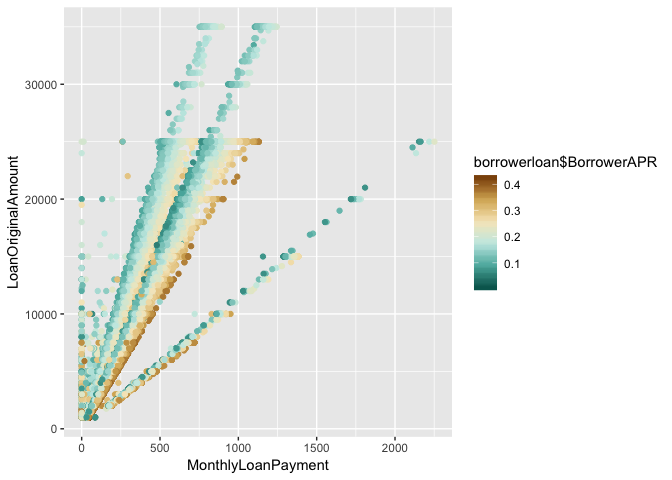
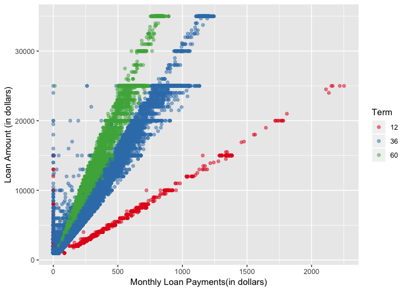

Prosper Loan Exploratory Data Analysis
by Shan Jafri
================

Introduction
========================
Prosper loan is a 

The size of the prosper dataset is very large with 81 variables and ~114,000 data points concerning both investers and borrowers. I choose variables that are of interest to borrowers and reduced the number of variable size to 13. The main variable of interest is loan amount.

Univariate Plots Section
========================

First, I looked at each of the 13 variable.

    ##    Min. 1st Qu.  Median    Mean 3rd Qu.    Max. 
    ##     0.0   131.6   217.7   272.5   371.6  2252.0

The price distribution of both the loan amount and monthly payment variables had a long tailed plot so I transformed the x-axis with log10 and square root, respectively. The transformed graph shows smaller values that were hidden previously. For the loan amount histogram, there are a significant amount of loans priced between 4000 and 14000. If we take a summary of the variable we find that 50% of the loans are actually between 4000 and 12000.

The next two main variables I plotted were interest rate and APR since APR is related to interest rate. I looked at the summary table and boxplot plot below.

    ##    Min. 1st Qu.  Median    Mean 3rd Qu.    Max. 
    ##  0.0000  0.1340  0.1840  0.1928  0.2500  0.4975

    ##    Min. 1st Qu.  Median    Mean 3rd Qu.    Max.    NA's 
    ## 0.00653 0.15630 0.20980 0.21880 0.28380 0.51230      25

The interquartile range(IQR) for APR is larger than the interest rate value. APR is the interest rate plus additional cost of taking out a loan and is the primary reason why the median and the IQR has a higher value.

    ##    Min. 1st Qu.  Median    Mean 3rd Qu.    Max. 
    ##       0    3200    4667    5608    6825 1750000

    ##    Min. 1st Qu.  Median    Mean 3rd Qu.    Max.    NA's 
    ##   0.000   0.140   0.220   0.276   0.320  10.010    8554

I did not transformed the axis but instead removed any values from the ggplot that were not within 99 percent of the distribution. The top 1% values for monthly income and debt to income ratio skewed the graphs.

    ##    Min. 1st Qu.  Median    Mean 3rd Qu.    Max.    NA's 
    ##     9.5   669.5   689.5   695.1   729.5   889.5     591

I created a new variable called MeanCredit which took the mean of the lower and upper creditscores variables. The graph shows mean credit scores that are have very low values.

#### Next, I focused on categorical variables.

I re-categorize the income range variables by merging borrowers that labeled "not employed" and borrower that labeled "$0"

    ##   Not employed  Not displayed      $1-24,999 $25,000-49,999 $50,000-74,999 
    ##           1427           7741           7274          32192          31050 
    ## $75,000-99,999      $100,000+ 
    ##          16916          17337

The majority of Prosper Loan borrowers have an income range between $25,000 - 74,999. Interestingly, borrowers that did not disclose there income received more loans than borrowers with an income range between 1-24,999.

I re-categorized the employment status variable by merging borrowers labeled as employed, full-time, part-time, and self-employed. I also merged borrowers labeled as "not employed" and "Not available".

    ## Employed(full/self/part-time)                  Not employed 
    ##                        100899                          6182 
    ##                         Other                       Retired 
    ##                          3806                           795 
    ##                          NA's 
    ##                          2255

The employment status variable shows that most borrowers have some type of job before applying for a loan.

Finally, I re-categorized the loan status variable. Any borrower that has a past due on there profile was merged together.

    ##                       Current                     Completed 
    ##                         56781                         38074 
    ## Past Due/Defaulted/Chargedoff                     Cancelled 
    ##                         19077                             5

Lastly, I looked at the number of loan terms for 12, 36, and 60 months.

    ##    12    36    60 
    ##  1614 87778 24545

The majority of loans had a payback term of 3 years.

The two variables that had outliers which could be ignored were monthly income and mean creditscore. The outliers from monthly income were around $150000 a month, 20 times more than the third quartile. The outliers for mean creditscore were zeros.

Univariate Analysis
===================

### What is the structure of your dataset?

I subset the prosper loan dataset to only include 15 variables. I ran a univariate analysis on 11 ( loan amount, monthly payment, APR, interest rates, monthly income, debt to income ratio, income range, mean credit score, employment status, loan term, loan status)

Main observations: - The median loan amount 6500 with a max loan amount of 3500 - The median monthly payment is 212 - 75% of the interest rates and APR were under 0.25 and 0.2838 - Most borrowers have an income range between 25,000 and 74,999 - Media Debt to Icome ratio is 0.22 when including outliers - Median Monthly Income is 4667 when including outliers

### What is/are the main feature(s) of interest in your dataset?

The main feature in the data set are loan amount and the monthly payments. I'd like to know which feature best predicts the price of the loan amount borrowers can get from prosper loan.

### What other features in the dataset do you think will help support your
investigation into your feature(s) of interest?

Monthly Income, Debt to Income Ratio, Term, Income Range, Mean CreditScore will most probably affect the price of the loan.

### Did you create any new variables from existing variables in the dataset?

The new variable, Credit Mean, took the mean of the lower and upper credit score variables.

### Of the features you investigated, were there any unusual distributions?
Did you perform any operations on the data to tidy, adjust, or change the form
of the data? If so, why did you do this?

I subset the prosper loan data for variables that were of interest to borrowers. I also removed large outliers for variables that clearly were not correct values so that the distribution would not be skewed. I also changed merged some of the categories for the categorical variables since there were some redundancies. The categorical variable employment status can be ignored since such a large percentage(90%) of borrower are in the employed category

Bivariate Plots Section
=======================

The correlation graph generated by a sample data set shows a strong correlation between loan amount and monthly payments. There are a several medium correlations(0.3-0.7) that affect loan amount such as monthly income, APR, interests, credit mean. I am interested in investigating quantitative variables that affect loan amount indirectly, such as mean credit and APR.

    ## 
    ## Call:
    ## lm(formula = LoanOriginalAmount ~ MonthlyLoanPayment, data = borrowerloan)
    ## 
    ## Residuals:
    ##    Min     1Q Median     3Q    Max 
    ## -43229  -1000   -332    340  24904 
    ## 
    ## Coefficients:
    ##                    Estimate Std. Error t value Pr(>|t|)    
    ## (Intercept)        96.38744   11.83094   8.147 3.77e-16 ***
    ## MonthlyLoanPayment 30.26101    0.03558 850.438  < 2e-16 ***
    ## ---
    ## Signif. codes:  0 '***' 0.001 '**' 0.01 '*' 0.05 '.' 0.1 ' ' 1
    ## 
    ## Residual standard error: 2255 on 111004 degrees of freedom
    ## Multiple R-squared:  0.8669, Adjusted R-squared:  0.8669 
    ## F-statistic: 7.232e+05 on 1 and 111004 DF,  p-value: < 2.2e-16

The relationship between loan price and monthly payment appears to be linear yet there are 4 distict lines that stem from the zero axis in different direction. I wonder what the reasos for those 4 distict lines are? The monthly loan payment explain 87% of the variance in the loan amount based on the R^2 value.

Next, I'll look at the APR and interests.

There's some negative correlation between loan amount and both APR and Interests.

The monthly income of borrowers positively correlates with the loan amount recieved.

There's also a positive correlation between the mean credit score and the original loan amount.

I'd like to see if there's a correlation between monthly loan payment and monthly income.

Interestingly, the scatter plot reaches a plateu.

Next, I'll look at categorical variables and how they vary with monthly payment and loan amount.

    ## borrowerloan$Term: 12
    ##    Min. 1st Qu.  Median    Mean 3rd Qu.    Max. 
    ##     0.0   181.2   284.5   377.3   433.4  2252.0 
    ## -------------------------------------------------------- 
    ## borrowerloan$Term: 36
    ##    Min. 1st Qu.  Median    Mean 3rd Qu.    Max. 
    ##     0.0   123.7   181.9   259.0   350.8  1244.0 
    ## -------------------------------------------------------- 
    ## borrowerloan$Term: 60
    ##    Min. 1st Qu.  Median    Mean 3rd Qu.    Max. 
    ##   12.33  207.70  301.10  313.80  395.70  892.40

Median monthly payments are largest for borrowers with a 5 year loan term and borrowers with a 3 year loan term have the lowest median monthly loan payment.

    ## borrowerloan$LoanStatus: Current
    ##    Min. 1st Qu.  Median    Mean 3rd Qu.    Max. 
    ##     0.0   166.5   286.7   316.9   413.0  2164.0 
    ## -------------------------------------------------------- 
    ## borrowerloan$LoanStatus: Completed
    ##    Min. 1st Qu.  Median    Mean 3rd Qu.    Max. 
    ##    0.00   95.33  172.10  219.10  297.40 2252.00 
    ## -------------------------------------------------------- 
    ## borrowerloan$LoanStatus: Past Due/Defaulted/Chargedoff
    ##    Min. 1st Qu.  Median    Mean 3rd Qu.    Max. 
    ##     0.0   118.7   174.6   245.0   322.5  1553.0 
    ## -------------------------------------------------------- 
    ## borrowerloan$LoanStatus: Cancelled
    ##    Min. 1st Qu.  Median    Mean 3rd Qu.    Max. 
    ##   32.62   35.86   39.10   52.37   62.24   85.38

Borrowers with completed loans paid slightly lower median monthly payment as past due borrowers.

    ## borrowerloan$IncomeRange: Not employed
    ##    Min. 1st Qu.  Median    Mean 3rd Qu.    Max. 
    ##    0.00   88.78  169.70  220.30  265.70 1131.00 
    ## -------------------------------------------------------- 
    ## borrowerloan$IncomeRange: Not displayed
    ##    Min. 1st Qu.  Median    Mean 3rd Qu.    Max. 
    ##    0.00   84.94  137.00  201.40  249.60 1048.00 
    ## -------------------------------------------------------- 
    ## borrowerloan$IncomeRange: $1-24,999
    ##    Min. 1st Qu.  Median    Mean 3rd Qu.    Max. 
    ##    0.00   86.38  134.30  154.70  173.70 1048.00 
    ## -------------------------------------------------------- 
    ## borrowerloan$IncomeRange: $25,000-49,999
    ##    Min. 1st Qu.  Median    Mean 3rd Qu.    Max. 
    ##     0.0   118.9   173.7   210.4   282.8  1382.0 
    ## -------------------------------------------------------- 
    ## borrowerloan$IncomeRange: $50,000-74,999
    ##    Min. 1st Qu.  Median    Mean 3rd Qu.    Max. 
    ##     0.0   155.8   253.1   280.3   383.7  1778.0 
    ## -------------------------------------------------------- 
    ## borrowerloan$IncomeRange: $75,000-99,999
    ##    Min. 1st Qu.  Median    Mean 3rd Qu.    Max. 
    ##     0.0   169.5   301.6   329.4   457.2  2112.0 
    ## -------------------------------------------------------- 
    ## borrowerloan$IncomeRange: $100,000+
    ##    Min. 1st Qu.  Median    Mean 3rd Qu.    Max. 
    ##     0.0   204.1   370.1   405.9   552.2  2252.0

Borrowers with higher incomes receive larger amounts of loans. What's interesting is borrowers that have an income of zero or did not report their income have larger median loans compared to people with an income range of $1-$4999.

    ## borrowerloan$IsBorrowerHomeowner: False
    ##    Min. 1st Qu.  Median    Mean 3rd Qu.    Max. 
    ##     0.0   121.3   181.7   240.2   330.2  2164.0 
    ## -------------------------------------------------------- 
    ## borrowerloan$IsBorrowerHomeowner: True
    ##    Min. 1st Qu.  Median    Mean 3rd Qu.    Max. 
    ##     0.0   155.8   261.9   304.2   406.2  2252.0

Borrowers with home ownership have larger median monthly payment.

    ## borrowerloan$Term: 12
    ##    Min. 1st Qu.  Median    Mean 3rd Qu.    Max. 
    ##    1000    2000    3500    4626    5000   25000 
    ## -------------------------------------------------------- 
    ## borrowerloan$Term: 36
    ##    Min. 1st Qu.  Median    Mean 3rd Qu.    Max. 
    ##    1000    3137    5000    7288   10000   35000 
    ## -------------------------------------------------------- 
    ## borrowerloan$Term: 60
    ##    Min. 1st Qu.  Median    Mean 3rd Qu.    Max. 
    ##    2000    8000   11500   12310   15000   35000

Loan terms of 5 years have the largest median laons.

    ## borrowerloan$LoanStatus: Current
    ##    Min. 1st Qu.  Median    Mean 3rd Qu.    Max. 
    ##    2000    4000   10000   10270   15000   35000 
    ## -------------------------------------------------------- 
    ## borrowerloan$LoanStatus: Completed
    ##    Min. 1st Qu.  Median    Mean 3rd Qu.    Max. 
    ##    1000    2600    4500    6195    8000   35000 
    ## -------------------------------------------------------- 
    ## borrowerloan$LoanStatus: Past Due/Defaulted/Chargedoff
    ##    Min. 1st Qu.  Median    Mean 3rd Qu.    Max. 
    ##    1000    3000    5000    6795    9000   35000 
    ## -------------------------------------------------------- 
    ## borrowerloan$LoanStatus: Cancelled
    ##    Min. 1st Qu.  Median    Mean 3rd Qu.    Max. 
    ##    1000    1000    1000    1500    1750    2500

    ## borrowerloan$LoanStatus: Current
    ##    Min. 1st Qu.  Median    Mean 3rd Qu.    Max. 
    ##    2000    4000   10000   10270   15000   35000 
    ## -------------------------------------------------------- 
    ## borrowerloan$LoanStatus: Completed
    ##    Min. 1st Qu.  Median    Mean 3rd Qu.    Max. 
    ##    1000    2600    4500    6195    8000   35000 
    ## -------------------------------------------------------- 
    ## borrowerloan$LoanStatus: Past Due/Defaulted/Chargedoff
    ##    Min. 1st Qu.  Median    Mean 3rd Qu.    Max. 
    ##    1000    3000    5000    6795    9000   35000 
    ## -------------------------------------------------------- 
    ## borrowerloan$LoanStatus: Cancelled
    ##    Min. 1st Qu.  Median    Mean 3rd Qu.    Max. 
    ##    1000    1000    1000    1500    1750    2500

    ## borrowerloan$IncomeRange: Not employed
    ##    Min. 1st Qu.  Median    Mean 3rd Qu.    Max. 
    ##    1000    2500    4000    5987    7500   25000 
    ## -------------------------------------------------------- 
    ## borrowerloan$IncomeRange: Not displayed
    ##    Min. 1st Qu.  Median    Mean 3rd Qu.    Max. 
    ##    1000    2500    4000    5719    7000   25000 
    ## -------------------------------------------------------- 
    ## borrowerloan$IncomeRange: $1-24,999
    ##    Min. 1st Qu.  Median    Mean 3rd Qu.    Max. 
    ##    1000    2052    4000    4274    5000   25000 
    ## -------------------------------------------------------- 
    ## borrowerloan$IncomeRange: $25,000-49,999
    ##    Min. 1st Qu.  Median    Mean 3rd Qu.    Max. 
    ##    1000    3000    5000    6178    9800   25000 
    ## -------------------------------------------------------- 
    ## borrowerloan$IncomeRange: $50,000-74,999
    ##    Min. 1st Qu.  Median    Mean 3rd Qu.    Max. 
    ##    1000    4000    7500    8675   13500   25000 
    ## -------------------------------------------------------- 
    ## borrowerloan$IncomeRange: $75,000-99,999
    ##    Min. 1st Qu.  Median    Mean 3rd Qu.    Max. 
    ##    1000    4000    9700   10370   15000   25000 
    ## -------------------------------------------------------- 
    ## borrowerloan$IncomeRange: $100,000+
    ##    Min. 1st Qu.  Median    Mean 3rd Qu.    Max. 
    ##    1000    6000   12000   12910   18000   35000

    ## borrowerloan$IsBorrowerHomeowner: False
    ##    Min. 1st Qu.  Median    Mean 3rd Qu.    Max. 
    ##    1000    3050    5000    7118   10000   35000 
    ## -------------------------------------------------------- 
    ## borrowerloan$IsBorrowerHomeowner: True
    ##    Min. 1st Qu.  Median    Mean 3rd Qu.    Max. 
    ##    1000    4000    8000    9541   15000   35000

It makes sense that home owners receive larger median loans. Home owners receive a median amount 1.5 times more than no home owners.

Mean credit is strongly and negatively correlated with interest rates. The same is true with APR.

Bivariate Analysis
==================

### Talk about some of the relationships you observed in this part of the investigation. How did the feature(s) of interest vary with other features in the dataset?

There's a strong correlation between loan amount and monthly payment. The R^2 value indicates monthly loan payments accounts for 87% variance in loan amount. Possibly, other relationships can be used in the model to explain variation in price.

APR and interest rate have a negative medium strength correlation with loan amount. Large loans tend to have lower APR and interest rates.

Monthly income and loan amount and mean credit and loan amount have a medium strength positive correlation.

Borrowers with higher income range receive larger loans and naturally employment status effects the size of a loans. Additionally, home owners and longer loan terms receive larger loans.

### Did you observe any interesting relationships between the other features (not the main feature(s) of interest)?

There's a positive correlation between mean credit scrores and both interest rates and APR.

### What was the strongest relationship you found?

The loan amount is postively and strongly correlated with monthly loan payments. The monthly income and mean credit positively correlate with loan amount but with a medium strength. Also, APR and interest rate negatively and with medium strength correlated with loan amount. All of these variables could be used to form a predictive model for the loan amount borrowers from prosper loan can receive.

Multivariate Plots Section
==========================

Although loan amounts correlates with both monthly loan payments and monthly income it is difficult to visualize in this graph. I'd still like to put monthly income variable in my linear model to see if it's a good predicter of loan amount.

The mean credit score gives a slightly lower monthly payment price.

The pattern holds nearly the same for APR and interest rates with higher interests rates producing higher monthly payments.

Loan terms hevaily influence loan amounts based on this graph.

It isn't clear if income range effects the loan amount.

Monthly payment doesn't seem correlated with home ownership however borrowers with high monthly payments and hight loan amounts are likely not home owners. Additionally, borrowers with 1 year loan terms where for the most part not homeowners.

### Linear Model Regression

    ## 
    ## Calls:
    ## s1: lm(formula = LoanOriginalAmount ~ MonthlyLoanPayment, data = borrowerloan)
    ## s2: lm(formula = LoanOriginalAmount ~ MonthlyLoanPayment + Term, 
    ##     data = borrowerloan)
    ## s3: lm(formula = LoanOriginalAmount ~ MonthlyLoanPayment + Term + 
    ##     BorrowerRate, data = borrowerloan)
    ## s4: lm(formula = LoanOriginalAmount ~ MonthlyLoanPayment + Term + 
    ##     BorrowerRate + BorrowerAPR, data = borrowerloan)
    ## s5: lm(formula = LoanOriginalAmount ~ MonthlyLoanPayment + Term + 
    ##     BorrowerRate + BorrowerAPR + StatedMonthlyIncome, data = borrowerloan)
    ## 
    ## ================================================================================================================================
    ##                                s1                   s2                   s3                   s4                   s5           
    ## --------------------------------------------------------------------------------------------------------------------------------
    ##   (Intercept)                    96.387***         -6570.469***         -4681.409***         -4776.411***         -4988.471***  
    ##                                 (11.831)             (40.395)             (37.225)             (43.314)             (43.378)    
    ##   MonthlyLoanPayment             30.261***            29.673***            28.709***            28.699***            28.379***  
    ##                                  (0.036)              (0.025)              (0.023)              (0.023)              (0.024)    
    ##   Term: 36/12                                       6171.996***          6497.456***          6573.480***          6543.411***  
    ##                                                      (39.758)             (35.151)             (39.364)             (39.111)    
    ##   Term: 60/12                                       9566.913***          9943.380***         10024.202***          9968.761***  
    ##                                                      (40.578)             (35.890)             (40.534)             (40.291)    
    ##   BorrowerRate                                                         -10161.706***        -12084.490***        -10970.622***  
    ##                                                                           (57.353)            (451.940)            (449.879)    
    ##   BorrowerAPR                                                                                 1791.120***           986.141*    
    ##                                                                                               (417.590)            (415.352)    
    ##   StatedMonthlyIncome                                                                                                 0.055***  
    ##                                                                                                                      (0.001)    
    ## --------------------------------------------------------------------------------------------------------------------------------
    ##   R-squared                       0.867                0.936                0.950                0.950                0.951     
    ##   adj. R-squared                  0.867                0.936                0.950                0.950                0.951     
    ##   sigma                        2254.719             1566.868             1383.416             1383.308             1374.153     
    ##   F                          723245.264           538829.384           526256.192           421074.617           355833.892     
    ##   p                               0.000                0.000                0.000                0.000                0.000     
    ##   Log-likelihood           -1014562.660          -974161.436          -960338.146          -960328.948          -959591.380     
    ##   Deviance             564317392525.163     272518420301.478     212438254376.508     212403050755.186     209599141173.889     
    ##   AIC                       2029131.321          1948332.872          1920688.292          1920671.895          1919198.759     
    ##   BIC                       2029160.173          1948380.959          1920745.996          1920739.217          1919275.698     
    ##   N                          111006               111006               111006               111006               111006         
    ## ================================================================================================================================

The variables in the linear model account for 95% of the variance in loan amount. The loan term variable accounts for 7% increase in loan amount variance.

Multivariate Analysis
=====================

### Talk about some of the relationships you observed in this part of the investigation. Were there features that strengthened each other in terms of looking at your feature(s) of interest?

The loan amount and monthly payment was significantly higher for shorter loan terms. The monthly loans varied with both APR and interest rates when holding loan amount constant.

All four features, loan term, interest rates, and APR when plotted with monthly payments and loan amount suggested I can make a linear model to predict the loan price.

### Were there any interesting or surprising interactions between features?

I was suprised that monthly income, income range, and mean credit did not incorporate variation to loan amount.

### Did you create any models with your dataset? Discuss the strengths and limitations of your model.

I created a linear model with loan amount and monthly loan payments. The 5 variables accounted for 95.1% of the variation in amount of loan a borrower received. Interest rates and loan terms are features which increased the R^2 value from 87% to 95$. Features such as monthly income, APR, and monthly income slightly improved the R^2 value if at all. The term on the loan had the largest effect on loan amount. The prosper loan data set is not up to date with information only from 2005 to 2014. This could create limitation in the linear model.

------------------------------------------------------------------------

Final Plots and Summary
=======================

### Plot One

### Description One

The amount of loan appears to correlates with the monthly loan payments. The graph has distict lines that stem from the orgin of the graph.

### Plot Two

    ## Warning: Removed 391 rows containing non-finite values (stat_boxplot).

    ## Warning: Removed 4966 rows containing non-finite values (stat_boxplot).

### Description Two

Loan amounts are generally higher for longer term lenghts. The 5 year term lenght has the highest median. The median monthly loan payments for 3 year terms are the lowest.

### Plot Three

### Description Three

The plot indicates that a linear model could be created to predict the loan amount with the monthly loan payment variabel and the loan amount variable. The loan amount varies with loan term. The longer loan terms are almost always larger in loan amounts than shorter loan terms.

------------------------------------------------------------------------

Reflection
==========

The propser loan data set had 81 variables with 113937 variables from 2005 to 2014. My first step was to formulate a research topic, What information effects the amount of loan a borrower could receive from Prosper?. I then started by understanding each of the 81 variables and picked 13 of them. I explore the relationship between the 12 variables and the amount of loan each borrower from prosper data recieves and created a linear model to predict the amount of loan a borrower can get from prosper.

In the bivariate analysis, I created a correlation matrix between all of the quantitative variables. The amount of loan and monthly payments correlated at 0.93. I struggled to create a correlation matrix with categorical variables and had to compare each categorical variable with monthly loan and loan amount. I was surprised that monthly income. mean credit score, and income range did not contribute to a large variation in loan amount.

Some of the limitation of the model include the data. The loans listed in the data are from 2005 to 2014 and does not account for new methods Prosper uses for determining the amount of loans to give out. For future work on this data, I would investigate the values of zero for monthly payments. I would also be interested in evaluating the the amount of loans given to borrowers with an income range of "Not Employed". It surprises me that these borrowers had higher median loan amounts than borrowers with median income range of $1-$24,999.

